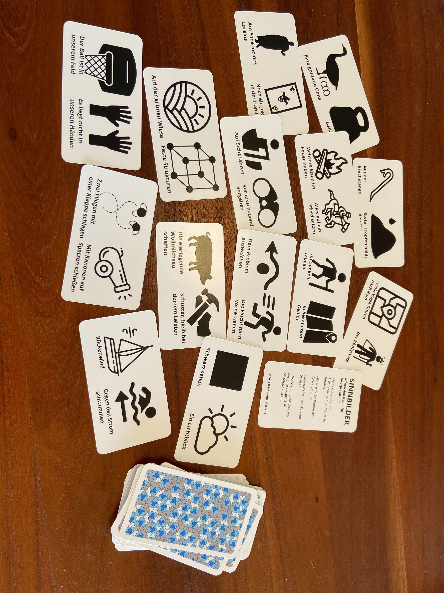

## Ein Tool zum Zuhören  
Ein Bild erzählt Tausend Worte...ein Sinnbild noch mehr!

SINNBILDER wurden erschaffen, um Menschen zum Reflektieren zu animieren. Ob bei der Arbeit oder beim Vergnügen, wir Menschen sind mitteilsame Kreaturen.

SINNBILDER werfen Öl auf unser kommunikatives Feuer und schaffen Raum für Perspektivenwechsel durch Sprichwörter und Metaphern, mit denen jeder Mensch seine ganz eigenen Assoziationen und Historie hat. Jede Karte zeigt zwei gegenteilige Sinnbilder.

Sie sind ein Tool zum Zuhören!

© Brian Junker-Latocha 2022
