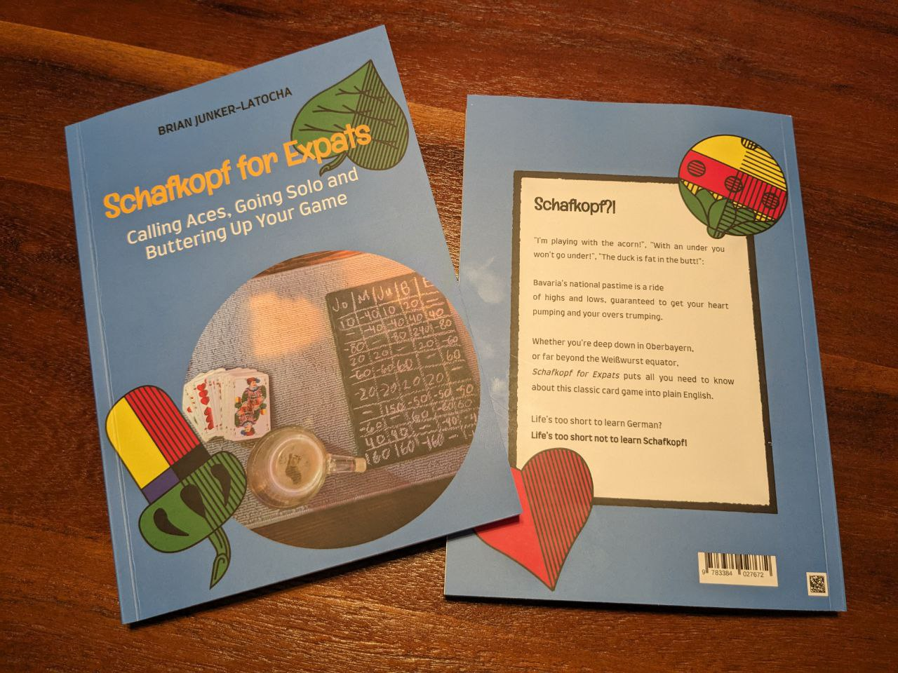

The best (and only) book out there about Bavarian Schafkopf in English! 

## Schafkopf?!

"I'm playing with the acorn!", "With an under you won't go under!", "The duck is fat in the butt!":

Bavaria's national pastime is a ride of highs and lows, guaranteed to get your heart thumping and your overs trumping.

Whether you're deep down in Oberbayern, or far beyond the Weißwurst equator, *Schafkopf for Expats* puts all you need to know about this classic card game into plain English.

Life's too short to learn German?
Life's too short not to learn Schafkopf!